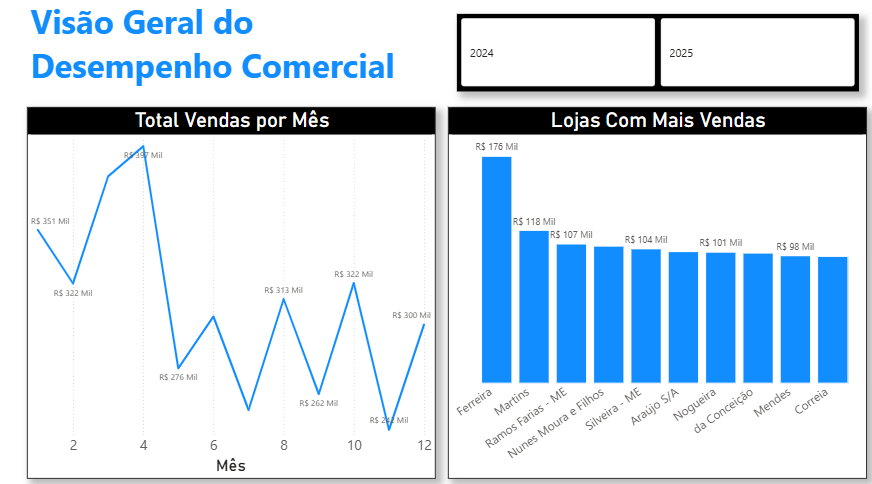

Análise de Desempenho Comercial

Objetivo
Analisar o desempenho de vendas internas da empresa, identificando
evolução ao longo do tempo, lojas com maior performance e os principais
produtos e funcionários responsáveis pelos resultados.

Ferramentas Utilizadas
- Power BI
- Power Query
- DAX
- SQL Server (modelagem e preparação dos dados)

Estrutura do Modelo
- Fato: fSales
- Dimensões: dProducts, dStores, dEmployees, dDate
- Modelo em estrela com relacionamentos 1:N

Principais KPIs
- Total de Vendas
- Quantidade de Vendas
- Ticket Médio
- Evolução mensal das vendas
- Top produtos por faturamento
- Performance por funcionário
- Performance por loja

Dashboards

- Visão Geral do Desempenho Comercial

- Performance Comercial

Observações
Projeto desenvolvido com foco em boas práticas de modelagem,
clareza visual e storytelling de negócio.
